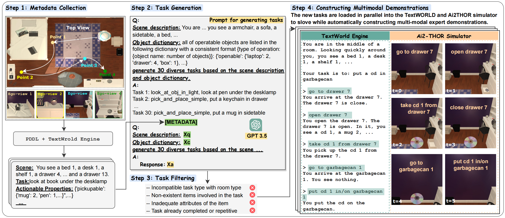

# MuEP
This repository is the official implementation of the following paper.

**[A Multimodal Benchmark for Embodied Planning with Foundation Models](https://www.ijcai.org/proceedings/2024/0015.pdf)**
<br/>
[Kanxue Li](https://scholar.google.com.hk/citations?user=QLGwtYUAAAAJ&hl=en), [Baosheng Yu](https://scholar.google.com.hk/citations?user=fjzIdMQAAAAJ&hl=en), [Qi Zheng](https://scholar.google.com.hk/citations?hl=en&user=WbM2PosAAAAJ),[Yibing Zhan](https://scholar.google.com.hk/citations?user=rjd977cAAAAJ&hl=en),Yuhui Zhang,[Tianle Zhang](https://scholar.google.com.hk/citations?user=2MXFRAMAAAAJ&hl=en), [Yijun Yang](https://scholar.google.com/citations?user=X0quXnsAAAAJ&hl=en), Yue Chen, Lei Sun, [Qiong Cao](https://scholar.google.com.hk/citations?user=JYtbNBsAAAAJ&hl=en), [Li Shen](https://sites.google.com/site/mathshenli/home), Lvsong Li, [Dapeng Tao](https://scholar.google.com/citations?user=AQzS40gAAAAJ&hl=en), [Xiaodong He](https://scholar.google.com/citations?user=W5WbqgoAAAAJ&hl=en)
<br/>




## Abstract

Foundation models have demonstrated signifcant emergent abilities, holding great promise for enhancing embodied agents’ reasoning and planning capacities. However, the absence of a comprehensive benchmark for evaluating embodied agents with multimodal observations in complex environments remains a notable gap. In this paper, we present MuEP, a comprehensive Multimodal benchmark for Embodied Planning. MuEP facilitates the evaluation of multimodal and multi-turn interactions of embodied agents in complex scenes, incorporating fne-grained evaluation metrics that provide insights into the performance of embodied agents throughout each task. Furthermore, we evaluate embodied agents with recent state-of-the-art foundation models, including large language models (LLMs) and large multimodal models (LMMs), on the proposed benchmark. Experimental results show that foundation models based on textual representations of environments usually outperform their visual counterparts, suggesting a gap in embodied planning abilities with multimodal observations. We also fnd that control language generation is an indispensable ability beyond common-sense knowledge for accurate embodied task completion. We hope the proposed MuEP benchmark can contribute to the advancement of embodied AI with foundation models.


## TODO

- [x] Release Testing environment for MuEP
- [x] Release [MuEP Dataset](https://huggingface.co/datasets/kanxue/MuEP_Dataset)
- [ ] Release dataset construction code
- [ ] Release evaluation and metrics code


## Citation

```
@inproceedings{ijcai2024p15,
  title     = {MuEP: A Multimodal Benchmark for Embodied Planning with Foundation Models},
  author    = {Li, Kanxue and Yu, Baosheng and Zheng, Qi and Zhan, Yibing and Zhang, Yuhui and Zhang, Tianle and Yang, Yijun and Chen, Yue and Sun, Lei and Cao, Qiong and Shen, Li and Li, Lusong and Tao, Dapeng and He, Xiaodong},
  booktitle = {Proceedings of the Thirty-Third International Joint Conference on
               Artificial Intelligence, {IJCAI-24}},
  publisher = {International Joint Conferences on Artificial Intelligence Organization},
  editor    = {Kate Larson},
  pages     = {129--138},
  year      = {2024},
  month     = {8},
  note      = {Main Track},
  doi       = {10.24963/ijcai.2024/15},
  url       = {https://doi.org/10.24963/ijcai.2024/15},
}
```
